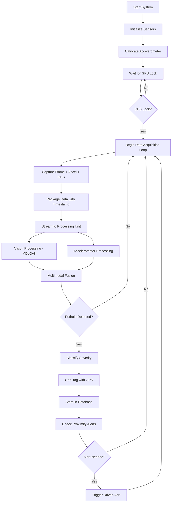

# An Integrated Multi-Sensor Embedded System for Real-Time Pothole Detection, Classification, and Driver Alerting

## Project Overview

This project presents a low-cost, embedded, multi-sensor system for real-time pothole detection, severity classification, and driver alerting. The system uses a Raspberry Pi platform for **data acquisition only**, integrating camera-based vision capture, accelerometer-based vibration sensing, and GPS-based geo-tagging. The ML processing and inference are performed on a separate processing unit (laptop/PC/server), enabling a practical and scalable prototype for intelligent road monitoring and driver safety.

The primary goal is to overcome the limitations of single-sensor pothole detection systems by fusing vision and vibration data, enabling robust detection under varying environmental conditions and providing severity-aware, location-based alerts to drivers.

---

## Problem Statement

Road potholes are a major cause of vehicle damage, traffic delays, and accidents worldwide. Existing pothole detection systems primarily rely on single-sensor approaches, such as smartphone accelerometers or camera-based vision systems. These methods suffer from significant limitations:

- **Environmental sensitivity:** Vision-based systems fail under rain, low visibility, or poor lighting conditions, while accelerometer-only systems generate false positives due to speed bumps, rough roads, or vehicle-specific vibrations.
- **Lack of severity classification:** Most systems only detect pothole presence without estimating its depth or potential risk.
- **Delayed or offline reporting:** Many platforms rely on post-collection reporting rather than real-time driver alerts.
- **Fragmented implementation:** Existing research addresses individual aspects such as GPS tagging, sensor detection, or image processing, but lacks a fully integrated, low-cost system that combines all these features.

This project addresses these limitations by developing a fully integrated, multi-sensor system that captures synchronized camera and accelerometer data, classifies pothole severity, geo-tags potholes using GPS, and provides real-time alerts to nearby drivers.

---

## Project Objectives

- **Accurate pothole detection under varying conditions**
  - Detect potholes reliably in different lighting and weather conditions.

- **Multimodal sensor fusion**
  - Fuse camera vision and MPU6050 accelerometer data to improve robustness and reduce false positives.

- **Severity classification**
  - Classify potholes into Low, Medium, and High severity based on vibration amplitude and visual features.

- **GPS-based geo-tagging**
  - Record latitude and longitude of detected potholes for mapping and alert purposes.

- **Real-time driver alerts**
  - Notify approaching vehicles of high-severity potholes using proximity-based alert logic.

- **Embedded data acquisition prototype**
  - Implement the data acquisition system on a Raspberry Pi with ML inference on a separate processing unit.

---

## Selected System Architecture

### Architecture Name

**Distributed Edge-Capture with Centralized ML Processing Architecture**

### Rationale

This architecture is selected as the best fit for the current prototype because it:

- Separates data acquisition (embedded) from ML inference (PC/server)
- Reduces computational load on Raspberry Pi
- Enables use of more powerful ML models without hardware constraints
- Supports real-time multimodal sensor fusion on processing unit
- Reduces false positives through hierarchical decision logic
- Supports severity classification
- Integrates GPS-based geo-tagging
- Enables local, real-time driver alerts
- Scales easily to cloud or smart city platforms in future

---

## High-Level System Architecture

```
┌─────────────────────────────────────────────────────────────────────────────┐
│                    DATA ACQUISITION UNIT (Raspberry Pi)                      │
├─────────────────────────────────────────────────────────────────────────────┤
│                                                                              │
│  ┌──────────────┐    ┌──────────────┐    ┌──────────────┐                   │
│  │   Camera     │    │   MPU6050    │    │   NEO-6M     │                   │
│  │   Module     │    │ Accelerometer │    │     GPS      │                   │
│  └──────┬───────┘    └──────┬───────┘    └──────┬───────┘                   │
│         │                   │                   │                            │
│         ▼                   ▼                   ▼                            │
│  ┌─────────────────────────────────────────────────────────────┐            │
│  │              Sensor Synchronization Module                   │            │
│  │         (Timestamp alignment + Data packaging)               │            │
│  └──────────────────────────┬──────────────────────────────────┘            │
│                             │                                                │
│                             ▼                                                │
│  ┌─────────────────────────────────────────────────────────────┐            │
│  │                    Data Transmission                         │            │
│  │           (WiFi/USB/Ethernet to Processing Unit)             │            │
│  └──────────────────────────┬──────────────────────────────────┘            │
│                             │                                                │
└─────────────────────────────┼────────────────────────────────────────────────┘
                              │
                              ▼
┌─────────────────────────────────────────────────────────────────────────────┐
│                    ML PROCESSING UNIT (Laptop/PC/Server)                     │
├─────────────────────────────────────────────────────────────────────────────┤
│                                                                              │
│  ┌──────────────┐    ┌──────────────┐                                       │
│  │  YOLOv8 CNN  │    │   Signal     │                                       │
│  │  Detection   │    │  Processing  │                                       │
│  └──────┬───────┘    └──────┬───────┘                                       │
│         │                   │                                                │
│         └─────────┬─────────┘                                                │
│                   ▼                                                          │
│         ┌──────────────────┐                                                 │
│         │  Multimodal      │                                                 │
│         │  Fusion Engine   │                                                 │
│         └────────┬─────────┘                                                 │
│                  │                                                           │
│                  ▼                                                           │
│         ┌──────────────────┐         ┌──────────────────┐                   │
│         │ Severity Class   │────────▶│  Local Storage   │                   │
│         │ + Geo-Tag        │         │  (SQLite/JSON)   │                   │
│         └────────┬─────────┘         └──────────────────┘                   │
│                  │                                                           │
│                  ▼                                                           │
│         ┌──────────────────┐                                                 │
│         │  Alert Server    │                                                 │
│         │  (Flask/FastAPI) │                                                 │
│         └──────────────────┘                                                 │
│                                                                              │
└─────────────────────────────────────────────────────────────────────────────┘
```

---

## Hardware Components

### Data Acquisition Unit (Raspberry Pi Zero WH)

| Component | Purpose | Specifications |
|-----------|---------|----------------|
| Raspberry Pi Zero WH | Main data acquisition controller | Single-core 1GHz ARM11, 512MB RAM, built-in WiFi & Bluetooth |
| Camera Module v2 (CSI) | Visual data capture | 480p (640x480) @ 30fps |
| MPU6050 Accelerometer/Gyroscope | Vibration sensing | ±16g range, 100Hz sampling |
| GPS Module (NEO-6M) | Geo-location | ≤2.5m CEP accuracy |
| MicroSD Card (16GB+) | Local buffering | Class 10 or higher |
| Power Supply | Vehicle power | 12V→5V buck converter (1.5A) |

### Raspberry Pi Zero WH Constraints & Considerations

> [!WARNING]
> The Pi Zero WH has limited processing power. The following optimizations are essential:

| Constraint | Mitigation Strategy |
|------------|---------------------|
| **Limited RAM (512MB)** | Use lightweight libraries; avoid loading full OpenCV; stream frames instead of buffering |
| **Single-core CPU (1GHz)** | No on-device preprocessing; capture and stream only |
| **No USB-A port** | Use OTG adapter for USB peripherals or use CSI camera + I2C/UART sensors |
| **Lower WiFi throughput** | Compress images (JPEG quality 70-80%) before transmission |
| **Heat under load** | Add passive heatsink; limit continuous high-FPS capture |

### Optional Alert Components

| Component | Purpose |
|-----------|---------|
| Buzzer | Audio alert indication |
| LED Indicators | Visual status feedback |
| Small Display (OLED) | Real-time status display |

### ML Processing Unit (Laptop/PC/Server)

| Component | Minimum Requirement |
|-----------|---------------------|
| CPU | Intel i5 / AMD Ryzen 5 or higher |
| RAM | 8GB minimum, 16GB recommended |
| GPU (Optional) | NVIDIA GTX 1060+ for accelerated inference |
| Storage | SSD with 50GB+ free space |

---

## Software Components

### Data Acquisition Unit (Raspberry Pi)

| Software | Purpose |
|----------|---------|
| Python 3.9+ | Main programming language |
| OpenCV | Camera capture and frame handling |
| smbus / smbus2 | MPU6050 I2C communication |
| pyserial / pynmea2 | GPS NMEA parsing |
| Flask / Socket.IO | Data streaming to processing unit |
| NumPy | Sensor data buffering |

### ML Processing Unit

| Software | Purpose |
|----------|---------|
| Python 3.9+ | Main programming language |
| OpenCV | Image preprocessing |
| Ultralytics YOLOv8 | CNN-based pothole detection |
| SciPy | Signal processing for accelerometer data |
| Scikit-learn / XGBoost | Severity classification |
| Flask / FastAPI | Alert and API server |
| SQLite | Lightweight local database |

---

## Detailed Subsystem Description

### Sensor Synchronization Strategy

> [!IMPORTANT]
> Proper sensor synchronization is critical for accurate multimodal fusion.

**Synchronization Approach:**

1. **Master Clock:** Raspberry Pi system clock serves as master timestamp source
2. **Timestamped Frames:** Each camera frame tagged with millisecond-precision timestamp
3. **Buffered Sensor Data:** Accelerometer data buffered in sliding window (500ms)
4. **GPS Polling:** GPS coordinates captured at 1Hz, interpolated for intermediate events
5. **Data Packet Structure:**

```python
{
    "timestamp_ms": 1706102400000,
    "frame_id": 12345,
    "image_base64": "...",  # or file path
    "accelerometer": {
        "x": [-0.12, 0.05, 2.34, ...],  # 50 samples
        "y": [0.02, -0.01, 0.15, ...],
        "z": [9.81, 9.79, 12.45, ...],
        "sample_rate_hz": 100
    },
    "gps": {
        "latitude": 12.9716,
        "longitude": 77.5946,
        "speed_kmh": 35.2,
        "hdop": 1.2
    }
}
```

---

### Data Acquisition Subsystem (Raspberry Pi)

**Camera Capture Module:**
- Captures frames at 15-30 FPS depending on resolution
- Resolution: 640x480 (balanced) or 1280x720 (high quality)
- Applies basic preprocessing (resize only, ML preprocessing on PC)
- Buffers frames with timestamps

**Accelerometer Module:**
- Samples at 100Hz for vibration detection
- Applies on-device low-pass filter (cutoff: 20Hz)
- Detects vibration spikes using threshold: `|Z| > 1.5g`
- Triggers frame capture burst on spike detection

**GPS Module:**
- Parses NMEA sentences (GGA, RMC)
- Extracts: latitude, longitude, speed, HDOP
- Handles signal loss gracefully (uses last known position)

**Data Transmission:**
- Streams data via WiFi to processing unit
- Protocol: WebSocket (low latency) or HTTP POST (reliable)
- Fallback: Local buffering to SD card if connection lost

---

### Vision Subsystem (YOLOv8 on Processing Unit)

**Preprocessing Pipeline:**

| Step | Operation | Purpose |
|------|-----------|---------|
| 1 | Resize to 640x640 | Model input standardization |
| 2 | Histogram equalization | Handle varying lighting |
| 3 | Gaussian blur (optional) | Reduce noise |
| 4 | Normalization | Scale pixel values 0-1 |

**YOLOv8 Detection:**
- Model: YOLOv8n (nano) or YOLOv8s (small) for speed
- Outputs:
  - Bounding box coordinates (x, y, w, h)
  - Detection confidence score (0-1)
  - Class label (pothole)

**Visual Feature Extraction:**

```python
visual_features = {
    "confidence": 0.87,
    "bbox_area_px": 15420,
    "bbox_aspect_ratio": 1.3,
    "bbox_center_y": 380  # Lower = closer to vehicle
}
```

---

### Accelerometer Processing Subsystem

**Signal Processing Pipeline:**

```
Raw Data → Low-Pass Filter → Baseline Removal → Peak Detection → Feature Extraction
```

**Processing Steps:**

1. **Low-Pass Filter:** Butterworth filter, cutoff 20Hz
2. **Baseline Removal:** Subtract running mean (1-second window)
3. **Peak Detection:** Identify spikes where `|acceleration| > threshold`
4. **Feature Extraction:**

```python
vibration_features = {
    "peak_magnitude_g": 2.8,
    "peak_duration_ms": 120,
    "rms_amplitude": 1.45,
    "zero_crossings": 8
}
```

---

### Multimodal Fusion and Severity Classification

**Fusion Strategy: Decision-Level Fusion**

```
┌────────────────────────────────────────────────────────────────┐
│                    FUSION DECISION MATRIX                       │
├──────────────────┬─────────────────┬───────────────────────────┤
│ Vision Detection │ Accel Detection │ Final Decision            │
├──────────────────┼─────────────────┼───────────────────────────┤
│ HIGH (>0.8)      │ HIGH (>2.5g)    │ ✅ POTHOLE - High Severity │
│ HIGH (>0.8)      │ LOW (<1.5g)     │ ✅ POTHOLE - Low Severity  │
│ MEDIUM (0.5-0.8) │ HIGH (>2.0g)    │ ✅ POTHOLE - Med Severity  │
│ MEDIUM (0.5-0.8) │ LOW (<1.5g)     │ ⚠️ UNCERTAIN - Log only   │
│ LOW (<0.5)       │ HIGH (>2.5g)    │ ⚠️ Speed bump / rough road │
│ LOW (<0.5)       │ LOW (<1.5g)     │ ❌ NO POTHOLE              │
└──────────────────┴─────────────────┴───────────────────────────┘
```

**Severity Classification Rules:**

| Severity | Criteria |
|----------|----------|
| **HIGH** | `accel_peak > 2.5g` AND `confidence > 0.7` AND `bbox_area > 10000px` |
| **MEDIUM** | `accel_peak > 1.8g` AND `confidence > 0.6` AND `bbox_area > 5000px` |
| **LOW** | `accel_peak > 1.2g` AND `confidence > 0.5` |

**Optional ML-Based Classification:**
- Train Random Forest / XGBoost on labeled dataset
- Features: acceleration peak, RMS, confidence, bbox area, aspect ratio
- Output: Severity class with probability

---

### GPS Geo-Tagging Subsystem

**Data Captured Per Event:**

```python
pothole_event = {
    "pothole_id": "PH_20260124_143052_001",
    "latitude": 12.971599,
    "longitude": 77.594566,
    "altitude_m": 920.5,
    "heading_deg": 45.2,
    "speed_kmh": 32.5,
    "severity": "HIGH",
    "confidence": 0.89,
    "timestamp": "2026-01-24T14:30:52.123Z",
    "image_path": "/data/images/PH_20260124_143052_001.jpg"
}
```

**GPS Signal Loss Handling:**
- If HDOP > 5: Flag location as "approximate"
- If no fix for >30 seconds: Use dead reckoning with last speed/heading
- Store raw image for manual geo-tagging later

---

### Local Storage Subsystem

**Database Schema (SQLite):**

```sql
CREATE TABLE potholes (
    id INTEGER PRIMARY KEY AUTOINCREMENT,
    pothole_id TEXT UNIQUE NOT NULL,
    latitude REAL NOT NULL,
    longitude REAL NOT NULL,
    severity TEXT CHECK(severity IN ('LOW', 'MEDIUM', 'HIGH')),
    confidence REAL,
    accel_peak REAL,
    bbox_area INTEGER,
    speed_kmh REAL,
    image_path TEXT,
    timestamp DATETIME DEFAULT CURRENT_TIMESTAMP,
    is_verified BOOLEAN DEFAULT FALSE,
    notes TEXT
);

CREATE INDEX idx_location ON potholes(latitude, longitude);
CREATE INDEX idx_severity ON potholes(severity);
```

---

### Alert and Proximity Server

**Alert Logic:**

```python
def check_proximity_alert(current_lat, current_lon, current_heading):
    nearby = query_potholes_within_radius(current_lat, current_lon, radius_m=200)
    
    for pothole in nearby:
        distance = haversine_distance(current_lat, current_lon, 
                                       pothole.latitude, pothole.longitude)
        bearing = calculate_bearing(current_lat, current_lon,
                                    pothole.latitude, pothole.longitude)
        
        # Only alert if pothole is ahead (within ±45° of heading)
        if abs(bearing - current_heading) < 45:
            if pothole.severity == "HIGH" and distance < 100:
                trigger_alert("CRITICAL", f"Pothole in {int(distance)}m")
            elif pothole.severity == "MEDIUM" and distance < 50:
                trigger_alert("WARNING", f"Pothole in {int(distance)}m")
```

**Alert Methods:**

| Method | Implementation |
|--------|---------------|
| Console | Print colored warning messages |
| Buzzer | PWM tone via GPIO (if connected) |
| LED | Red/Yellow/Green status indicators |
| Audio (TTS) | pyttsx3 or gTTS for voice alerts |
| Mobile App | WebSocket push to companion app |

---

## Data Collection Pipeline (For Training)

> [!NOTE]
> This section describes how to collect labeled data for training the ML models.

### Data Collection Workflow

1. **Preparation:**
   - Mount sensors securely on test vehicle
   - Calibrate accelerometer (flat surface calibration)
   - Verify GPS lock before starting

2. **Collection Routes:**
   - Include varied road conditions (good, fair, poor)
   - Cover different times of day (morning, noon, evening)
   - Include weather variations if possible

3. **Labeling Strategy:**
   - Use physical button on Raspberry Pi to mark pothole encounters
   - Record ground truth severity (driver assessment)
   - Capture multiple passes over same potholes

4. **Data Organization:**

```
/data_collection/
├── session_20260124_1430/
│   ├── metadata.json
│   ├── video/
│   │   └── raw_capture.mp4
│   ├── frames/
│   │   ├── frame_00001.jpg
│   │   └── ...
│   ├── accelerometer/
│   │   └── accel_log.csv
│   ├── gps/
│   │   └── gps_log.csv
│   └── labels/
│       └── pothole_annotations.json
```

### Annotation Format

```json
{
    "frame_id": "frame_00142",
    "timestamp_ms": 1706102412345,
    "annotations": [
        {
            "class": "pothole",
            "bbox": [120, 280, 85, 60],
            "severity_ground_truth": "HIGH",
            "notes": "Deep pothole, visible water"
        }
    ]
}
```

---

## Environmental Robustness Strategies

| Condition | Detection Strategy |
|-----------|-------------------|
| **Night / Low Light** | Rely primarily on accelerometer; lower vision confidence threshold |
| **Rain / Wet Roads** | Increase accelerometer weight in fusion; flag detections as "wet conditions" |
| **Glare / Shadows** | Apply histogram equalization; use HSV color space preprocessing |
| **Dusty Camera** | Monitor image clarity metrics; alert for cleaning if degraded |
| **GPS Signal Loss** | Use last known position + dead reckoning; flag as approximate |

---

## Edge Case Handling

| Edge Case | Handling Strategy |
|-----------|-------------------|
| Speed bump detected | High accel + no vision detection → classify as "non-pothole bump" |
| Pothole visually detected but no vibration | Low-speed detection or shallow pothole → log with low confidence |
| Multiple potholes in frame | Process each bounding box separately; geo-tag largest first |
| Sensor conflict (vision YES, accel NO) | Prefer accel for immediate alert; flag for review |
| Camera obstruction | Detect low-contrast frames; rely on accelerometer only |
| Vehicle stationary | Disable detection; monitor for movement to resume |

---

## System Workflow



---

## Testing and Validation

### Quantifiable Metrics and Targets

| Metric | Target | Measurement Method |
|--------|--------|-------------------|
| Detection Accuracy | ≥ 90% | Precision + Recall on test dataset |
| False Positive Rate | ≤ 5% | FP / (FP + TN) |
| False Negative Rate | ≤ 10% | FN / (FN + TP) |
| Severity Classification Accuracy | ≥ 85% | Confusion matrix analysis |
| End-to-End Latency | ≤ 1000ms | Timestamp from capture to alert |
| GPS Accuracy | ≤ 5m CEP | Comparison with surveyed positions |
| System Uptime | ≥ 99% | Continuous operation test (8+ hours) |

### Test Scenarios

1. **Controlled Environment Test:**
   - Known pothole locations on test track
   - Measure detection rate and false positives

2. **Real-World Driving Test:**
   - 50+ km of varied road conditions
   - Validate severity classification

3. **Environmental Stress Test:**
   - Low light conditions (dawn/dusk)
   - Wet road surfaces
   - High vibration roads (cobblestone)

4. **Long-Duration Test:**
   - 8-hour continuous operation
   - Monitor for memory leaks, sensor drift

---

## Power Management

### Power Consumption Estimates

| Component | Power Draw |
|-----------|-----------|
| Raspberry Pi Zero WH | 0.5-1.2W typical |
| Camera Module v2 | 0.25W |
| MPU6050 | <0.1W |
| GPS NEO-6M | 0.1W |
| **Total (Acquisition Unit)** | **~1-2W** |

### Vehicle Power Integration

- **Power Source:** OBD-II port or cigarette lighter (12V)
- **Converter:** 12V to 5V/1.5A buck converter (Pi Zero requires less power)
- **Protection:** Fuse + reverse polarity protection
- **Startup:** Boot on ignition ON; graceful shutdown on ignition OFF

---

## Expected Outcomes

- Functional multi-sensor pothole data acquisition system
- Synchronized camera, accelerometer, and GPS data streams
- Improved detection accuracy through multimodal fusion
- Reliable severity classification (Low/Medium/High)
- Real-time driver alerts for high-risk potholes
- Low-cost, practical prototype (~$100-150 hardware)
- Labeled dataset for future ML model improvements
- Architecture suitable for future cloud and smart city integration

---

## Future Scope

- **Cloud Integration:** Centralized pothole database with crowd-sourced data
- **Vehicle-to-Vehicle (V2V):** LoRa/ESP-NOW based alert sharing
- **Deep Learning Fusion:** End-to-end trained multimodal network
- **Smart City Dashboard:** Real-time pothole map for municipalities
- **Mobile App:** Companion app with map visualization
- **Automatic Reporting:** Integration with road authority APIs
- **Edge ML:** Move inference to Coral Edge TPU for fully embedded system

---

## Final Architecture Summary

**Selected Architecture:** Distributed Edge-Capture with Centralized ML Processing Architecture

This architecture separates data acquisition (Raspberry Pi) from ML inference (Laptop/PC), enabling:
- Lower-cost embedded hardware for field deployment
- More powerful ML models without hardware constraints
- Easy model upgrades without hardware changes
- Scalable transition to cloud processing in future

The system fully satisfies all project requirements and provides a robust, scalable foundation for real-time pothole detection, severity classification, GPS geo-tagging, and driver alerting.
